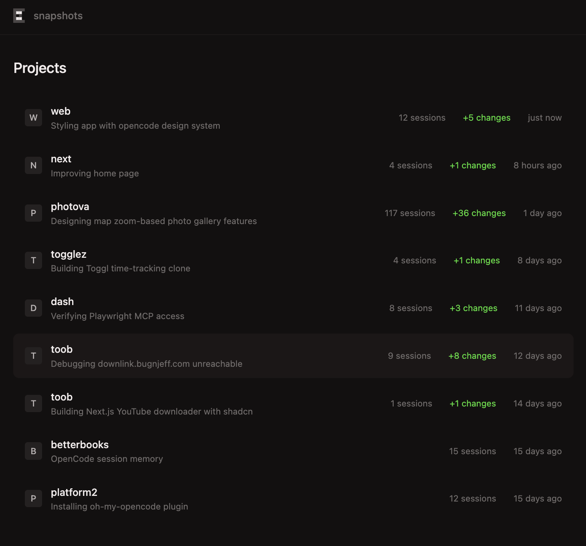
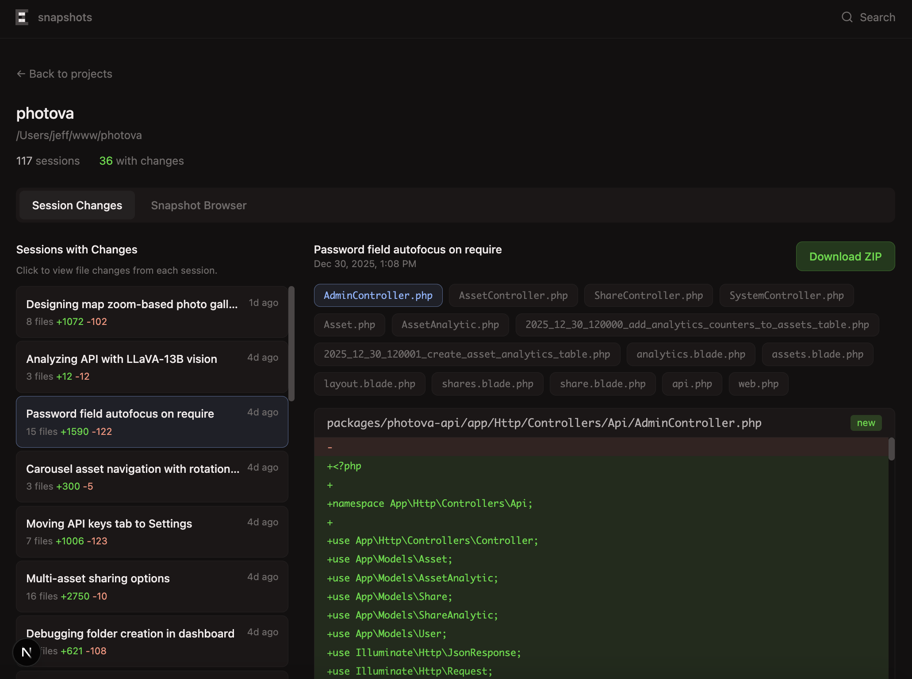
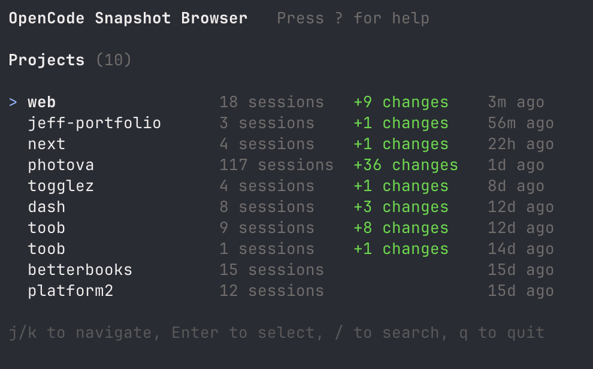

# OpenCode Snapshot Browser

Browse, view diffs, and **recover files** from [OpenCode](https://github.com/opencode-ai/opencode) sessions.

Available as both a **terminal UI** and a **web interface**.

<p>
  
  
</p>

## Features

- **Snapshot Browser**: Browse complete project state at any point in time
- **Session Changes**: View file diffs from each coding session with before/after toggle
- **Timeline View**: Navigate through thousands of snapshots captured during AI interactions
- **File Recovery**: Download any snapshot as ZIP to recover lost work
- **Search**: Find snapshots by searching conversation text (prompts and responses)

## Installation

```bash
# Install dependencies
npm install

# Build the TUI
npm run tui:install
npm run tui:build

# Link the CLI globally (optional)
npm link
```

## Usage

### Quick Start

```bash
ocs              # Launch terminal UI (default)
ocs serve        # Start web server at http://localhost:3000
```

### All Commands

| Command | Description |
|---------|-------------|
| `ocs` | Launch terminal UI |
| `ocs tui` | Launch terminal UI |
| `ocs serve` | Start web server (development mode) |
| `ocs web` | Start web server (alias for serve) |
| `ocs start` | Start web server (production mode) |
| `ocs help` | Show help |

### Without Global Install

```bash
node bin/ocs.mjs          # TUI
node bin/ocs.mjs serve    # Web server
```

## Terminal UI

The TUI provides keyboard-driven navigation optimized for quick browsing.



### Keyboard Shortcuts

| Key | Action |
|-----|--------|
| `j` / `k` | Navigate up/down |
| `Enter` | Select / Open |
| `Esc` | Go back |
| `Tab` | Switch tabs |
| `d` | Download snapshot as ZIP |
| `/` | Search conversations |
| `?` | Show help |
| `q` | Quit |

### Screens

1. **Project List**: All OpenCode projects
2. **Project Detail**: Two tabs - Snapshots (default) and Session Changes
3. **File Browser**: Browse files in a snapshot
4. **File Viewer**: View file contents with scroll support

## Web Interface

The web UI provides a richer visual experience with the same functionality.

- Project list with session counts
- Tabbed interface for Changes and Snapshots
- File tree browser with syntax highlighting
- ZIP download for any snapshot
- Full-text search across conversations

## Why This Exists

OpenCode captures a snapshot before every AI step (tool call), storing them as git tree objects. This tool exposes that hidden history, letting you:

- Recover a project that wasn't in version control
- Browse file contents from any point in your AI coding sessions
- Export complete project state from any moment in time

## How It Works

OpenCode stores data in `~/.local/share/opencode/`:

```
~/.local/share/opencode/
├── storage/
│   ├── project/          # Project metadata
│   ├── session/          # Session metadata (titles, summaries)
│   ├── session_diff/     # Before/after file contents per session
│   └── part/             # Message parts with snapshot references
└── snapshot/             # Git object storage (trees + blobs)
    └── {projectId}/      # Bare git repo per project
```

### Snapshot System

OpenCode uses git without commits:

1. Before each AI step: `git add . && git write-tree` → captures tree hash
2. Tree hash stored in `part/{messageId}/{partId}.json`
3. All file versions preserved in `snapshot/{projectId}/objects/`

This tool scans all parts, extracts snapshot hashes, and uses `git archive` to create downloadable ZIPs.

## Tech Stack

- **CLI**: Node.js
- **TUI**: [Ink](https://github.com/vadimdemedes/ink) (React for CLI)
- **Web**: Next.js 16 with App Router, Tailwind CSS
- **Language**: TypeScript

## API Routes (Web)

| Route | Description |
|-------|-------------|
| `GET /api/projects` | List all projects |
| `GET /api/projects/[id]/changes` | Get session file diffs |
| `GET /api/projects/[id]/snapshots` | Get snapshot timeline |
| `GET /api/snapshots/[projectId]/[hash]/files` | List files in snapshot |
| `GET /api/snapshots/[projectId]/[hash]/files?path=...` | Get file content |
| `GET /api/snapshots/[projectId]/[hash]/download` | Download snapshot as ZIP |
| `GET /api/sessions/[sessionId]/download` | Download session's latest snapshot as ZIP |
| `GET /api/search?q=...` | Search conversations for snapshots |

## License

MIT
