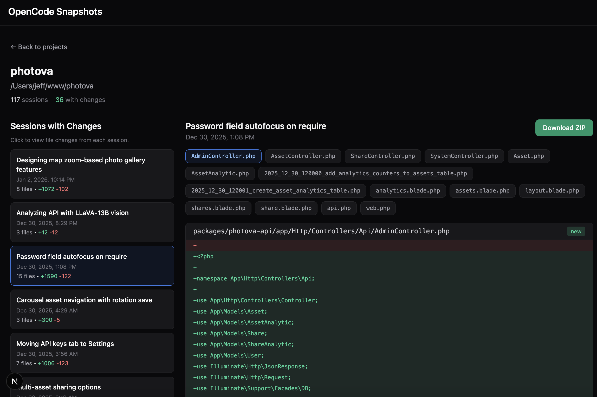

# OpenCode Snapshot Browser

A web UI to browse, view diffs, and **recover files** from [OpenCode](https://github.com/opencode-ai/opencode) sessions.



## Features

- **Session Changes**: View file diffs from each coding session with before/after toggle
- **Snapshot Browser**: Browse complete project state at any point in time
- **Timeline View**: Navigate through thousands of snapshots captured during AI interactions
- **File Recovery**: Download any snapshot as ZIP to recover lost work
- **Latest Snapshot**: Always-available current state export

## Why This Exists

OpenCode captures a snapshot before every AI step (tool call), storing them as git tree objects. This tool exposes that hidden history, letting you:

- Recover a project that wasn't in version control
- Browse file contents from any point in your AI coding sessions
- Export complete project state from any moment in time

## Installation

```bash
npm install
```

## Usage

```bash
npm run dev
```

Open http://localhost:3000

## How It Works

OpenCode stores data in `~/.local/share/opencode/`:

```
~/.local/share/opencode/
├── storage/
│   ├── project/          # Project metadata
│   ├── session/          # Session metadata (titles, summaries)
│   ├── session_diff/     # Before/after file contents per session
│   └── part/             # Message parts with snapshot references
└── snapshot/             # Git object storage (trees + blobs)
    └── {projectId}/      # Bare git repo per project
```

### Snapshot System

OpenCode uses git without commits:

1. Before each AI step: `git add . && git write-tree` → captures tree hash
2. Tree hash stored in `part/{messageId}/{partId}.json`
3. All file versions preserved in `snapshot/{projectId}/objects/`

This tool scans all parts, extracts snapshot hashes, and uses `git archive` to create downloadable ZIPs.

## Tech Stack

- **Framework**: Next.js 16 with App Router
- **Styling**: Tailwind CSS
- **Language**: TypeScript
- **Archive**: git archive (via child_process)

## API Routes

| Route | Description |
|-------|-------------|
| `GET /api/projects` | List all projects |
| `GET /api/projects/[id]/changes` | Get session file diffs |
| `GET /api/projects/[id]/snapshots` | Get snapshot timeline |
| `GET /api/snapshots/[projectId]/[hash]/files` | List files in snapshot |
| `GET /api/snapshots/[projectId]/[hash]/files?path=...` | Get file content |
| `GET /api/snapshots/[projectId]/[hash]/download` | Download snapshot as ZIP |

## License

MIT
